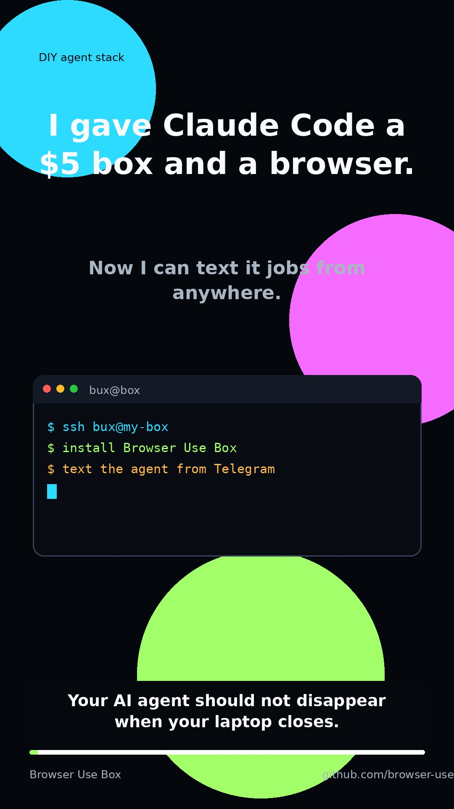

# Browser Use Box ♞


## Your 24/7 Claude Code agent with a real browser, on any box you own.

Rent any $5 VPS (Hetzner, DigitalOcean, Mac mini, Raspberry Pi — anything that runs Ubuntu), point one install script at it, and text your agent from anywhere.

```
$ curl -fsSL https://raw.githubusercontent.com/browser-use/bux/main/install.sh \
    | sudo BROWSER_USE_API_KEY=bu_xxx bash
```

Three minutes from a blank VPS to *"hey claude, check my email and summarize the unread ones"* via Telegram.

<a href="https://www.tiktok.com/@browser_use/video/7639824093721758989">
  
</a>

[Watch the 14-second Browser Use Box demo on TikTok](https://www.tiktok.com/@browser_use/video/7639824093721758989).

More launch links:

- [Public demo release](https://github.com/browser-use/bux/releases/tag/box-demo-2026-05-14)
- [Pinned announcement discussion](https://github.com/browser-use/bux/discussions/181)
- [Browser Use Box wiki](https://github.com/browser-use/bux/wiki)

## Setup prompt

Paste into Claude Code (on your laptop) and it will set up your VPS for you:

```text
Set up https://github.com/browser-use/bux on my remote box.

SSH into it (I'll paste the host below), run install.sh with my BROWSER_USE_API_KEY, and optionally wire up a Telegram bot if I give you a token from @BotFather. Read install.md first. After the install completes, verify the services are running (systemctl is-active bux-browser-keeper bux-ttyd), then become the `bux` user and run `claude /login` so I can complete the OAuth flow. Once logged in, test the setup by asking claude to visit https://browser-use.com and report the page title.
```

## What you get

- **Claude Code** logged in and always on
- A real **Chromium** session via [browser-harness](https://github.com/browser-use/browser-harness) — cookies persist, logins stick
- A **Telegram bot** so you can text your agent — pass `TG_BOT_TOKEN=xxx` to the installer to enable
- A **web terminal** bound to localhost for when SSH is too much
- When claude hits a login wall / 2FA / CAPTCHA, it hands you a **live view URL** and waits — no credential-stuffing, no brittle workarounds

## Requirements

- **A box** — Ubuntu 22.04+ with ≥2GB RAM. A $5/mo VPS is fine.
- **[Browser Use Cloud API key](https://cloud.browser-use.com/new-api-key)** — free tier: 3 concurrent browsers, proxies, CAPTCHA solving.
- An Anthropic API key *or* Claude Max subscription (claude asks on first `/login`).
- *(optional)* A Telegram bot token from [@BotFather](https://t.me/BotFather).

## How it works

```
  telegram ──►  telegram_bot.py ─┐
                                 ├──► claude -p  ──► browser-harness ──► BU Cloud
  browser  ──►  ttyd ────────────┘         │            (cdp over wss)
                                           ▼
                                  /home/bux (persistent state)
```

Three small services under systemd. Agent state lives in `/home/bux`, so reboots keep your cookies, skills, and chat history.

## Docs

- [install.md](install.md) — full install guide and troubleshooting
- [Playwright automation use case](docs/playwright-automation.md) — run logged-in browser automation from a 24/7 box
- [agent/CLAUDE.md](agent/CLAUDE.md) — the context claude loads on every session. Edit it to customize behavior (working dir layout, skill policies, allowed tools), then rerun `install.sh` — it's idempotent and the next claude turn picks up the change.

## Managed offering

If you'd rather not run your own VPS: [cloud.browser-use.com](https://cloud.browser-use.com) provisions a box for you in ~60s — same software, zero setup, one-command `bux up` via a Claude Code skill.

## Contributing

PRs welcome — bug fixes, docs tweaks, and new features all appreciated. Open an issue first if you're planning something larger.

## License

MIT. See [LICENSE](LICENSE).
